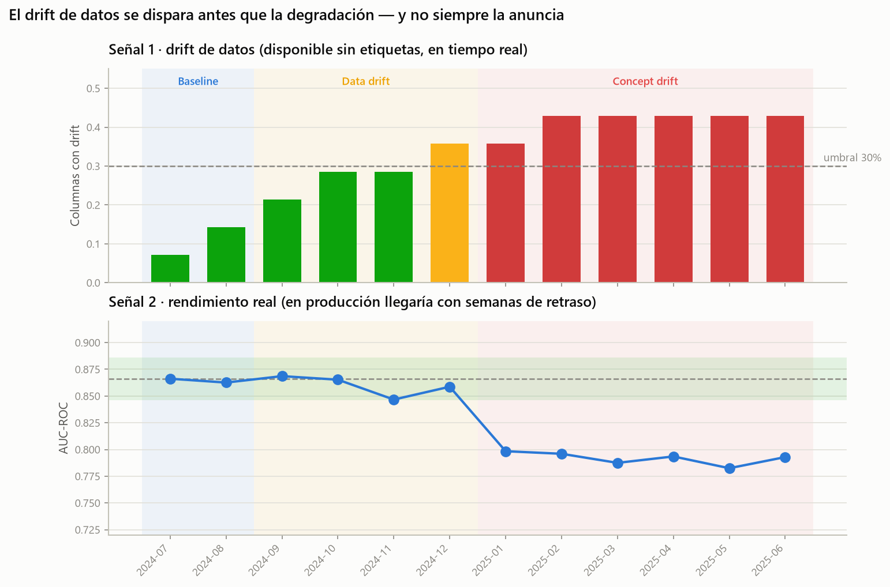
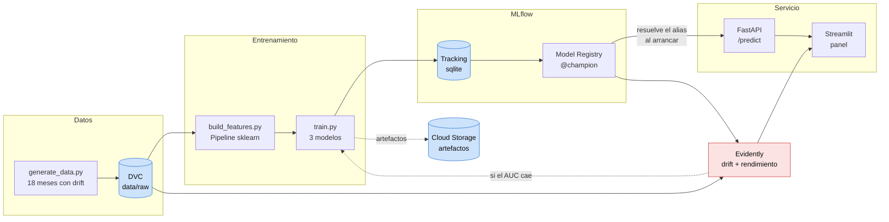
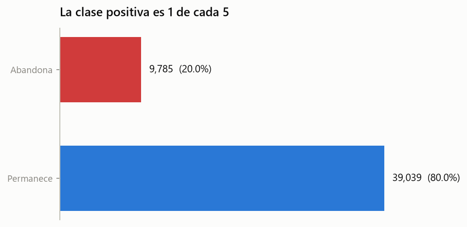
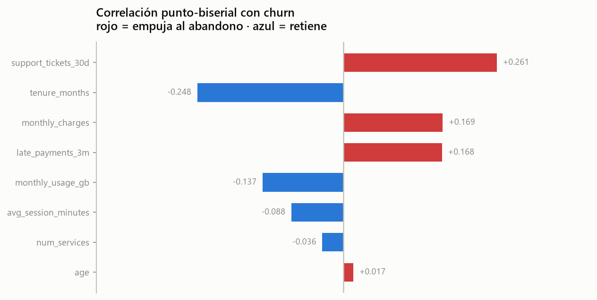
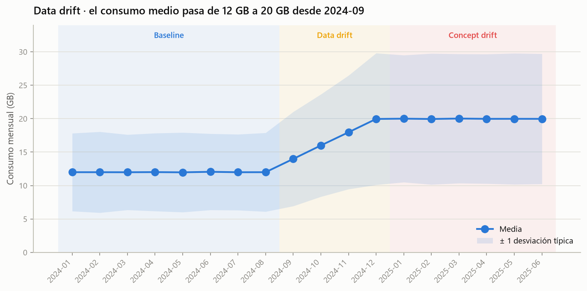
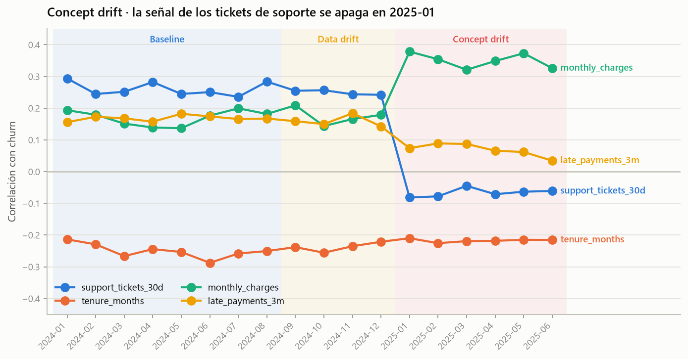

# MLOps Churn Pipeline

[](https://github.com/DanielPantoja08/mlops-churn-pipeline/actions/workflows/ci.yml)
[](https://danielpantoja08.github.io/mlops-churn-pipeline/)
[](https://www.python.org/)
[](LICENSE)

Pipeline MLOps end-to-end para predicción de abandono de clientes.

**Entrenar un modelo con buen AUC es la parte fácil.** Lo difícil es saber cuándo deja de servir.
Este proyecto trata ese problema como el problema central, no como un apéndice: el dataset lleva
drift inyectado a propósito en fechas conocidas, el análisis lo detecta a simple vista, el
monitoreo lo confirma con métricas, y el sistema está montado para que promover un modelo nuevo
no requiera desplegar nada.

---

## El resultado en un gráfico



Un modelo entrenado con enero–junio de 2024 se pone a servir y se vigila durante doce meses:

| Periodo | Qué pasa en los datos | Drift detectado | AUC real | Decisión correcta |
|---|---|---|---|---|
| 2024-07 → 08 | Nada | 7 % → 14 % | ~0.865 | Ninguna |
| **2024-09 → 12** | **Data drift**: el consumo medio pasa de 12 a 20 GB y cambia el método de pago | 21 % → **36 %** | **0.847 – 0.869 (estable)** | **Vigilar, NO reentrenar** |
| **2025-01 → 06** | **Concept drift**: los tickets de soporte dejan de predecir el churn | 36 % → 43 % | **0.78 – 0.80 (cae 6–8 pts)** | **Reentrenar** |

El drift de datos supera el umbral en **2024-12**. El modelo no se degrada hasta **2025-01**.

Ese desfase es todo el argumento del proyecto: durante meses hubo un cambio real y medible en la
distribución de entrada mientras el modelo seguía funcionando perfectamente. Un sistema que
reentrenase con cada alerta de drift habría gastado dinero y arriesgado un modelo sano. Uno que
solo mirase el rendimiento no se habría enterado hasta que las etiquetas llegaran, semanas
después. **Hacen falta las dos señales, y hay que saber leerlas juntas.**

---

## Arquitectura



Todo lo relacionado con GCP (Cloud Storage para artefactos, Secret Manager para configuración)
corre contra **[Floci](https://floci.io)**, un emulador de GCP en contenedor — en desarrollo y
también en CI. El código de la aplicación no sabe contra cuál de los dos está hablando.

---

## Lo que encontró el análisis exploratorio

El [análisis completo está publicado](https://danielpantoja08.github.io/mlops-churn-pipeline/),
con los contrastes estadísticos y las decisiones de feature engineering que se derivan de cada
hallazgo. Los cuatro que más peso tienen:

**1. Desbalance de clases 80/20 — por eso la accuracy no se usa en ningún sitio.**
Un modelo que prediga siempre «permanece» acierta el 80 % de las veces y no sirve para nada. De
ahí que la métrica de selección sea el AUC-ROC, acompañada de PR-AUC, y que los tres modelos
lleven `class_weight` o `scale_pos_weight`.



**2. El tipo de contrato domina, y `gender` no dice nada — que es el resultado correcto.**
`gender` se generó a propósito sin ningún efecto sobre el churn: es la variable de control. El
test de chi-cuadrado sale no significativo, lo que confirma que el procedimiento discrimina. Un
EDA que encuentra señal en todas las variables es un EDA que no está midiendo nada.



**3. El data drift es una rampa, no un escalón.**
El consumo medio sube de 12 a 20 GB a lo largo de cuatro meses. Los cambios reales de
comportamiento se propagan por la base de clientes; un escalón haría la detección trivial.



**4. La ruptura del concept drift se ve a simple vista, meses antes de instrumentar nada.**
La correlación entre `support_tickets_30d` y `churn` se mantiene estable en +0,25 durante trece
meses — incluido todo el periodo de data drift — y se desploma en 2025-01. El mejor predictor del
modelo deja de informar de golpe.



---

## Modelos

Split **temporal**, no aleatorio: entrenamiento con 2024-01..06, validación con 2024-07..08.

| Modelo | AUC-ROC | PR-AUC | F1 | Brecha train–validación |
|---|---|---|---|---|
| **Regresión logística** ← campeón | **0.8641** | **0.6646** | 0.5917 | **−0.0047** |
| XGBoost | 0.8517 | 0.6427 | 0.5955 | +0.0955 |
| LightGBM | 0.8489 | 0.6334 | 0.5908 | +0.1068 |

**Gana el baseline, y tiene sentido.** El proceso que genera los datos es un modelo logístico
latente, así que la regresión logística está correctamente especificada; los modelos de boosting
tienen capacidad de sobra para memorizar ruido y la métrica `overfit_gap_auc` lo confirma — más de
9 puntos de diferencia entre entrenamiento y validación frente a los −0,005 de la logística.

Registrar esa brecha como métrica y no solo mirar el AUC de validación es lo que convierte
«el baseline ganó» en un dato interpretable en vez de una casualidad.

---

## Cómo ejecutarlo

```bash
git clone https://github.com/DanielPantoja08/mlops-churn-pipeline.git
cd mlops-churn-pipeline
uv sync --all-extras --all-groups
```

### 1. Generar los datos y prepararlo todo

```bash
docker compose up -d floci-gcp          # emulador de GCP
uv run python scripts/bootstrap_floci.py # crea buckets y secretos
uv run python src/data/generate_data.py  # 18 CSV en data/raw/
```

### 2. Levantar el stack y entrenar

```bash
docker compose up -d --build             # Floci + MLflow + API

MLFLOW_TRACKING_URI=http://localhost:5000 \
STORAGE_EMULATOR_HOST=http://localhost:4588 \
uv run python src/training/train.py
```

Entrena los tres modelos, los compara y registra al ganador con el alias `@champion`.
La UI de MLflow queda en <http://localhost:5000>.

```bash
curl -X POST http://localhost:8000/reload   # la API recoge el modelo nuevo
```

### 3. Predecir

```bash
curl -X POST http://localhost:8000/predict \
  -H "Content-Type: application/json" \
  -d @examples/sample_request.json
```

```json
{
  "churn_probability": 0.9971,
  "churn_prediction": 1,
  "risk_band": "alto",
  "model_version": "1",
  "threshold": 0.5
}
```

Documentación interactiva en <http://localhost:8000/docs>.

### 4. Monitorear y ver el panel

```bash
uv run python monitoring/generate_report.py       # informes de Evidently
docker compose --profile tools up -d dashboard    # panel en :8501
```

Informes de Evidently navegables: [2024-12, drift con el modelo sano](https://danielpantoja08.github.io/mlops-churn-pipeline/monitoring/drift_2024-12.html)
· [2025-01, la degradación](https://danielpantoja08.github.io/mlops-churn-pipeline/monitoring/drift_2025-01.html)

### Tests

```bash
uv run pytest tests/unit          # 43 tests, sin dependencias externas
uv run pytest tests/integration   # 10 tests contra el GCP emulado
```

---

## Decisiones de diseño

Lo que sigue es el *porqué*, que es lo que distingue ejecutar de decidir.

| Decisión | Alternativa habitual | Por qué esta |
|---|---|---|
| **Split temporal** | `train_test_split(shuffle=True)` | El dataset es un panel: un shuffle pondría al mismo cliente en train y validación, y mezclaría los tres regímenes. La métrica saldría optimista y mediría un escenario —predecir el pasado con datos del futuro— que no existe en producción |
| **Preprocesamiento dentro del `Pipeline`** | Un script de features aparte que se replica al servir | Es la causa número uno de fallos silenciosos en producción. Si el escalado se desincroniza, el modelo sigue devolviendo números entre 0 y 1 sin lanzar ningún error: solo predice peor y nadie se entera |
| **Modelo desde el Model Registry** | Un `.pkl` dentro de la imagen de Docker | Con el modelo empaquetado, promover una versión exige reconstruir la imagen y redesplegar. Resolviendo `models:/churn-model@champion`, promover es mover un alias — el reentrenamiento automático deja de necesitar a una persona |
| **Alias, no `stages`** | `Staging` / `Production` | Los stages están deprecados desde MLflow 2.9 |
| **Backend sqlite en MLflow** | `mlflow.set_tracking_uri("./mlruns")` | El Model Registry no funciona sobre un file store, y sin registry no hay alias ni promoción |
| **La API carga el modelo en un hilo aparte** | Cargarlo en el `lifespan` | Descubierto por CI: si el registry no responde, MLflow reintenta con backoff durante minutos y uvicorn no llega a atender ni `/health`. El orquestador ve un contenedor mudo y lo reinicia en bucle. La degradación controlada solo funciona si el proceso arranca |
| **Floci en vez de GCP real** | Mockear los SDK, o desplegar para probar | Un mock verifica que llamas a la función; un emulador verifica que el SDK funciona contra un endpoint real, incluido el ciclo completo de subir un artefacto de modelo y recargarlo. Sin cuenta, sin cuota y sin credenciales en un job que no despliega |
| **`handle_unknown="ignore"` + categóricas mixtas** | Rechazar todo lo desconocido | Una región nueva es una novedad legítima del negocio; una edad de 400 es un error. `Literal` para los dominios cerrados, cadena libre para los que crecen |
| **Umbral de decisión configurable** | 0.5 fijo | El umbral correcto depende de lo que cueste una campaña de retención frente a lo que valga un cliente perdido. Es una decisión de negocio, no del modelo |
| **Intercepto calibrado por mes en el generador** | Dejar que la tasa de churn se mueva sola | Sin calibrar, la tasa caía del 22 % al 7 % por el uso al alza y la antigüedad acumulada. Con la prevalencia fija, una caída de AUC solo puede venir de un cambio de relación — el experimento tiene una variable independiente limpia |

---

## Estructura

```
├── src/
│   ├── config.py            # rutas, URIs y configuración de GCP en un solo sitio
│   ├── gcp.py               # clientes que funcionan igual con Floci y con GCP real
│   ├── tracking.py          # MLflow: setup, alias, promoción
│   ├── viz.py               # estilo compartido por notebooks y dashboard
│   ├── data/                # generador del dataset con drift
│   ├── features/            # pipeline de transformación
│   ├── training/            # entrenamiento y registro
│   └── api/                 # FastAPI
├── notebooks/eda/           # 4 notebooks, ejecutados y con salidas
├── monitoring/              # Evidently: informes y histórico
├── dashboard/               # panel Streamlit
├── tests/{unit,integration} # 53 tests
├── docs/                    # GitHub Pages: EDA e informes de drift
└── .github/workflows/       # CI y deploy
```

---

## Estado y límites

Lo que **funciona y está verificado**, no solo escrito:

- Dataset reproducible byte a byte, con drift documentado y **verificado por tests**
- 4 notebooks de EDA ejecutados, exportados y publicados
- 3 modelos trackeados en MLflow, campeón registrado con alias
- API en Docker que devuelve exactamente lo mismo que la ejecución local
- 53 tests en verde, incluidos 10 de integración contra GCP emulado en cada push
- Informes de drift para 12 meses, con el histórico consolidado

Lo que **no está hecho**, y por qué:

- **Despliegue real en GCP (Fase 7 del roadmap).** Floci no emula Cloud Run ni Artifact Registry.
  El workflow y los scripts están escritos y documentados en `.github/workflows/deploy.yml`;
  falta una cuenta de GCP. El código de la aplicación no cambia para pasar de uno a otro.
- **Orquestación con Airflow (Fase 9).** El DAG de reentrenamiento condicional no está
  implementado. Las piezas que necesitaría sí: `monitoring/generate_report.py` decide si hay que
  reentrenar, `train.py` reentrena y registra, y `tracking.promote()` mueve el alias.
- **Vídeo de demo.** El guion está en [`docs/DEMO.md`](docs/DEMO.md).

El plan por fases completo está en [`docs/roadmap.md`](docs/roadmap.md).

---

## Licencia

MIT
